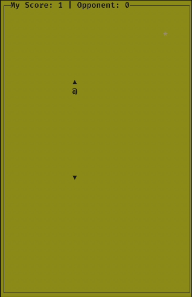

# Socket Snake

Terminal based two-player snake game.


## Note

This game is a fork of my standalone
[snake clone](https://github.com/AravindVasudev/snake) which on itself is
implemented over my [pacman clone](https://github.com/AravindVasudev/pacman).

## TODOs

- [ ] Exit cleanly when either of the player dies.
- [ ] Make both players different color.
- [ ] Make the UX better.
- [ ] Fix Makefile to remove relative imports of headerfiles.

## Building

The game uses unix sockets and hence is *NOT* supported in windows. I've
currently tested the build in MacOS but it should work just fine in any *nix
distribution as long as it has ncurses and sockets.

```
$ make

# Server
$ ./bin/snake serve 8080

# Client
$ ./bin/snake connect 127.0.0.1 8080
```